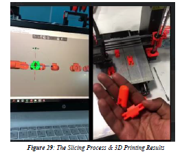
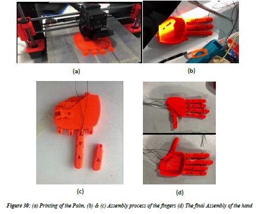
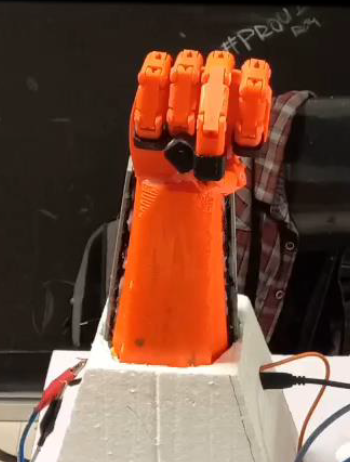

# Prosthetic-Arm-Control
It is a code to control a prosthetic arm which have Servo motors as actuators, strings to move each fingers, and input devices like EMG sensor and Bluetooth module. 
## Picture of the 3D print process of Prosthetic Arm
### Slicing of the CAD designs 

### 3D printed parts 

## Picture of the assembled Prosthetic Arm

### Reference 
The solidworks designs were taken from the opensource site (Minor improvement were made like enlarging the hole diameters so that the strings used would fit in it):
- https://mdesigns.space/projects/project-three-2jhsa
